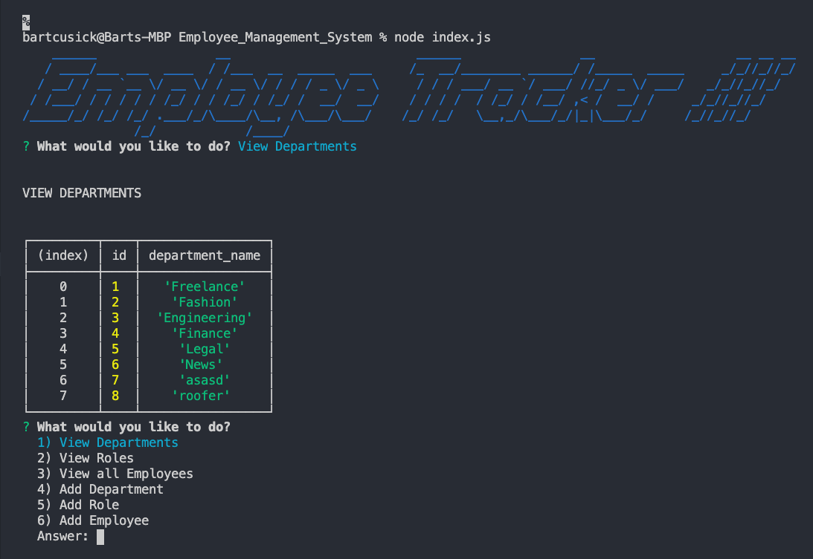

/////////////////////////////////////////////////////////////////////////////////////////////////////
# Employee-Tracker-CMS

## Description
  ```
  "As a business owner
I want to be able to view and manage the departments, roles, and employees in my company
So that I can organize and plan my business."
```
 This CLI (Command Line Interface) application demonstrates a simple CMS (Content Management System). The program uses Node.js, Inquire, console.table, and a MySQL database to display and record user input.


  
## Table of Contents


- [Installation](https://github.com/bartcusick/Employee_Management_System#installation)


- [Usage](https://github.com/bartcusick/Employee_Management_System#usage)


- [Repo](https://github.com/bartcusick/Employee_Management_System#repo)


- [Demonstration](https://github.com/bartcusick/Employee_Management_System#demonstration)

## Installation

 Use employeetracker_db.sql to create a database in MySQL Workbench. Use seeds.sql to populate the database. Use npm i to install all needed npm packages. Put your personal MySql password in the password section of index.js. Use node. js in your terminal to run index.js, then follow the prompts in the terminal.

## Usage
Assets/codeExample.png


## Questions

https://github.com/bartcusick

bartcusick@gmail.com

 ## Repo

https://github.com/bartcusick/Employee_Management_System

 
## Video Demonstration

https://www.youtube.com/watch?v=iWyDQJdITsI&feature=youtu.be